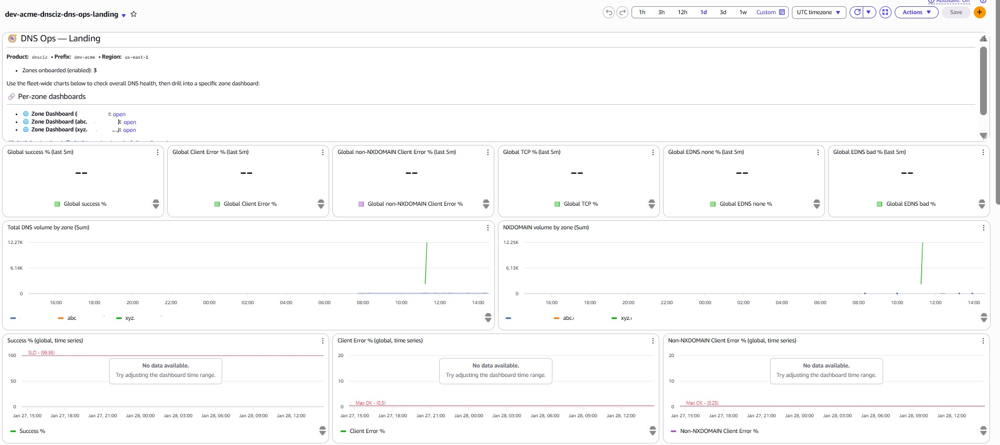
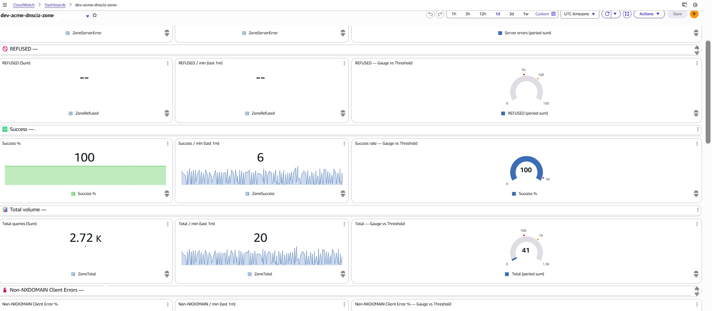
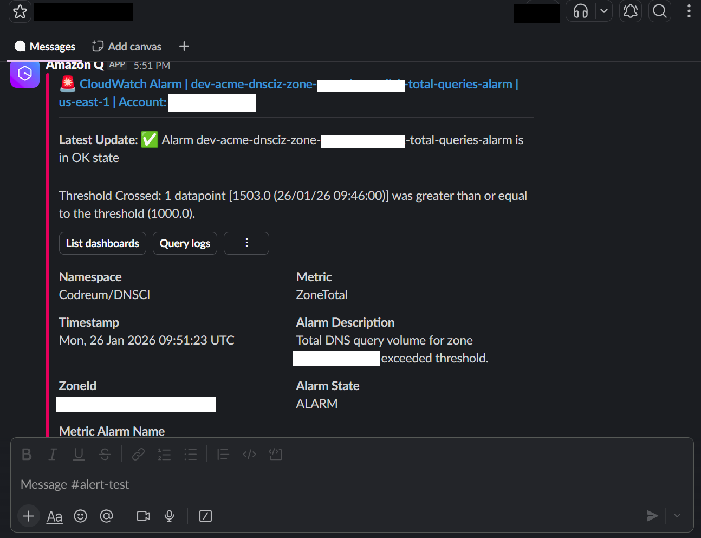

# Codreum DNS Monitoring (Pro) — DNSCI-Z (Hosted Zone)

<p align="center">
  <a href="https://github.com/Codreum/terraform-aws-dns-monitoring-pro/actions/workflows/ci.yml">
    
  </a>
</p>

<p align="center">
  <a href="https://github.com/Codreum/terraform-aws-dns-monitoring-pro/actions/workflows/ci.yml">
    
  </a>

  <a href="https://scorecard.dev/viewer/?uri=github.com/Codreum/terraform-aws-dns-monitoring-pro">
    
  </a>
</p>

<p align="center">
  <a href="https://github.com/Codreum/terraform-aws-dns-monitoring-pro/releases">
    
  </a>

  <a href="https://github.com/Codreum/terraform-aws-dns-monitoring-pro/blob/main/LICENSE">
    
  </a>
</p>

<p align="center">
  <a href="https://www.codreum.com">
    
  </a>
</p>

<p align="center">
  <a href="https://www.codreum.com">Website</a> •
  <a href="#why-use-codreum-dns-monitor">Why Codreum</a> •
  <a href="#screenshots">Screenshots</a> •
  <a href="#pricing-and-support">Pricing &amp; Support</a> •
  <a href="#quickstart">Quickstart</a> •
  <a href="#templates">Templates</a> •
  <a href="#limitations">Limitations</a> •
  <a href="#configuration-reference">Configuration Reference</a>
</p>

Production-grade DNS observability for **Route 53 hosted zone query logs** using **CloudWatch Logs → Metrics → Alarms → Dashboards → Contributor Insights**.

This module is designed to answer the questions that matter during incidents:

- **Are clients failing?** (success %, client error %, non-NXDOMAIN client error %)

- **What type of failure?** (NXDOMAIN vs REFUSED vs SERVFAIL vs rare)

- **Where is it happening?** (which zones / edges / clients)

- **What changed?** (qname/qtype/rcode/proto/EDNS mix)

- **Who is driving it?** (Top-N by qname/qtype/edge/client)

✅ Multi-zone support (one deployment can cover many hosted zones)

✅ Opinionated dashboards:

- **DNS Ops Landing** (fleet health + SLO tiles)

- **DNS Ops Investigations** (cross-zone hotspots + where to drill in)

- **DNS Ops Deep Forensics** (global mix breakdowns, longer window)

- **Per-zone dashboards** + **per-zone Top‑N drilldowns**

✅ More DNS health signals

✅ Rich Contributor Insights pack (profiles + matrices)

✅ Metric alarms + optional anomaly detection

✅ Deployed into **your AWS account** with **Terraform**

✅ Complete setup in less than 5 minutes

> This README is for the **Pro / paid** edition.
> If you only need NXDOMAIN signals, use the NXDOMAIN module instead: <https://github.com/Codreum/terraform-aws-dns-monitoring-nxdomain>

## Feature comparison

| Capability | NXDOMAIN | Pro |
|---|:---:|:---:|
| NXDOMAIN static alarms + anomaly detection | ✅ | ✅ |
| NXDOMAIN Contributor Insights (Top-N rules) | ✅ | ✅ |
| NXDOMAIN dashboards (Zone/VPC baseline) | ✅ | ✅ |
| Additional DNS metrics + Contributor Insights packs (SERVFAIL/REFUSED/etc.) | ❌ | ✅ |
| Per zone metrics/Alarm/CI toggle | ❌ | ✅ |
| Per-zone metric dashboards (beyond NXDOMAIN) | ❌ | ✅ |
| Per-zone Top-N dashboards (expanded) | ❌ | ✅ |
| Built-in SNS wiring presets (Email / Slack / SMS) | ❌ | ✅ |
| Log group management | ❌ | ✅ |
| Multiple zone IDs in one deployment | ❌ | ✅ |
| Advanced dashboards (Ops landing / Investigation / Forensics) | ❌ | ✅ |
| Licensing & enforcement | ❌ | ✅ |
| Support / SLA | ❌ | ✅ |

---

## Screenshots

Click any image to open it full-size.

### Dashboards

#### DNS Ops — Landing (fleet health + SLO tiles)

[](screenshots/dashboard-ops-landing.jpg)

#### DNS Ops — Investigations (cross-zone hotspots + drill-down)

[](screenshots/dashboard-investigations.jpg)

#### DNS Ops — Deep Forensics (global mix breakdowns)

[](screenshots/dashboard-forensic.jpg)

#### Per-zone dashboard (single-zone control panel)

[](screenshots/dashboard-per-zone.jpg)

#### Zone Top-N (Logs Insights drilldowns)

[](screenshots/dashboard-topn.jpg)

---

### Alarms

#### Alarm list (examples)

[](screenshots/alarms.jpg)

---

### Contributor Insights

#### Contributor Insights rules (enabled set)

[](screenshots/ci-rules.jpg)

#### Example Top-N view

[](screenshots/ci-topn.jpg)

---

### Notifications

#### Slack notification example (AWS Chatbot)

[](screenshots/slack-notification.png)

---

## Why use Codreum DNS Monitor?

DNS issues rarely look like “DNS is down.” They show up as:

- rising app latency (timeouts while resolvers retry)

- sporadic 5xx (only some clients / regions / edges impacted)

- failed deployments (wrong names, missing records)

- subtle misroutes (wrong answers, stale caching)

Codreum DNS Monitor is designed for **fast triage**:

- alert on the **right DNS signals** (not just “is port 53 open?”)

- instantly surface **what changed** (Top‑N by qname/qtype/edge/client)

- keep everything **inside your AWS account** (no DNS log shipping)

---

## Why AWS CloudWatch (in-account)?

External DNS checkers are useful, but they’re limited:

- they test from a few locations and only for **public DNS**

- they can’t see your real production resolver traffic patterns

- they miss “partial outages” (only some edges / clients / qtypes)

This solution uses your **real Route 53 hosted zone query logs** already in CloudWatch Logs:

- sees failures from **actual clients**

- runs fully **in-account** using CloudWatch Logs, Metrics, Alarms, Dashboards and Contributor Insights

- triages by **top offending domain / qtype / edge / source IP**

- avoids shipping DNS logs to third parties

> Privacy note: DNS logs stay in your account. Codreum does not receive your DNS logs.

---

## Get Pro (Pricing → Purchase → License → Connect Terraform)

This repository contains **templates + docs only**. The **Pro module code** is delivered via the **Codreum private Terraform registry**.

1) **See plans & pricing**: <https://www.codreum.com/products.html>
2) **Purchase / manage licenses** (login): <https://www.codreum.com/licenses.html>
3) In your license page, click **Connect Terraform** to get a short-lived code
4) Run:

```bash
codreum connect --code CT-REPLACE-ME
terraform init
terraform apply
```

Need help? Contact: <https://www.codreum.com/contact.html>

---

## What’s in this repo

- Copy/paste Terraform root templates (`templates/`)

- Docs for configuration + dashboards + operations

- Public reference for the Pro edition

---

## What’s not in this repo

- The Pro module implementation (delivered via Codreum private registry)

---

## Table of contents

- [License](#license-important)

- [Screenshots](#screenshots)

- [Pricing and support](#pricing-and-support)

- [Quickstart](#quickstart)

- [Templates](#templates)

- [Costs](#costs-aws-billed)

- [Security & data](#security--data)

- [Limitations](#limitations)

- [Configuration Reference](#configuration-reference)

---

## License (important)

This repo (docs + templates) is Apache-2.0.
The **Pro module code** is distributed via the **Codreum private Terraform registry** under commercial terms.
See: [LICENSE_SCOPE.md](LICENSE_SCOPE.md)

---

## Pricing and support

### What you pay Codreum

Codreum is licensed **per AWS account** (per-subject or unlimited zones). AWS usage is billed **separately by AWS**. Support is scoped to the Codreum module and **licensed subjects** (or the account, for unlimited).

| Plan | Price | Applies to | Best for |
|---|---:|---|---|
| Per-zone | **$79.99 / Hosted Zone / month** | Only the ZoneId(s) you license (and deploy) in that AWS account | Small-to-mid deployments |
| Unlimited Hosted Zones (per account) | **$799.99 / AWS account / month** | Unlimited Route 53 Hosted Zones in that single AWS account | 10+ zones, large fleets, fast growth |

**Break-even:** per-zone pricing is ~$799.90 at 10 zones/month, so **unlimited is typically better at 11+ zones** (and simplifies procurement).

Most teams recover the cost by avoiding even a single incident hour, or by not having to build and maintain custom metrics, alarms, dashboards, and Contributor Insights rules.

Purchase / manage:

- [Plans & pricing](https://www.codreum.com/products.html)
- [Licenses (login)](https://www.codreum.com/licenses.html)
- [Documentation](https://www.codreum.com/docs.html)
- [Knowledge Base](https://www.codreum.com/knowledge.html)
- [Open a support case (ticket portal)](https://www.codreum.com/cases.html)
- [Contact](https://www.codreum.com/contact.html)

#### Billing notes

- Pricing is shown in **USD**. Taxes (VAT/GST) may apply.
- Your **checkout/invoice is the source of truth** (including currency conversion where applicable).
- Licenses are scoped to the **AWS account** and either (a) the **ZoneId(s)** listed in your license (**per-subject**), or (b) the **AWS account** itself (**unlimited Hosted Zones**).

> A “licensed zone” means a Route 53 **Hosted Zone ID**.  
> Unlimited pricing (when purchased) applies to **Hosted Zones only** in that AWS account.

---

### What you pay AWS (separately)

This solution runs **entirely inside your AWS account** using CloudWatch Logs, Metrics, Alarms, Dashboards, and Contributor Insights.

AWS charges depend on your environment and usage (for example: log ingestion/storage, Logs Insights query scanning, custom metrics, alarms, and Contributor Insights rules). Route 53 query logging publishes into CloudWatch Logs, and CloudWatch pricing applies.

> Tip: Start with one zone + a small `act_metric` set to validate signal value and establish baseline CloudWatch spend, then scale out. Use a template that matches your rollout goal (dashboards-first, alerting-only, phased rollout, etc.).

---

### Included support (default)

- **Email support (best-effort, fair use)** with a **72-hour first-response target (wall clock)**
- Fair use covers: setup questions, configuration guidance, troubleshooting, and light tuning advice for licensed zones/VPCs
- Best-effort support is provided as capacity allows; it is **not** intended for urgent incident coordination or guaranteed turnaround
- If you need faster response times, Slack coordination, onboarding help, or recurring operational reviews, choose a paid support plan below
- Scope: **licensed zones/VPCs only**
- Self-serve docs + copy/paste Terraform templates included

---

### Support plans (optional)

If you need faster response times, Slack coordination, onboarding help, or recurring operational reviews, choose an upgrade tier below (priced **per AWS account per month**, licensed zones/VPCs only):

| Tier | Coverage | First response target | What’s included | Zoom allotment (scheduled) | Price (USD/mo) |
|---|---|---:|---|---:|---:|
| Basic | 5×8 | 48h | Email support | 1×30 min / month | 199 |
| Basic+ | 7×8 | 24h | Email support | 2×30 min / month | 399 |
| Elite | 5×16 | 24h | Email support + onboarding | 2×45 min / month | 799 |
| Elite+ | 7×16 | 24h | Email support + onboarding + monthly review | 3×45 min / month | 1299 |
| Advance | 5×16 | 16h | Priority handling + Slack + onboarding + 2 monthly reviews | 4×60 min / month | 1999 |
| Advance+ | 7×16 | 12h | Priority handling + Slack + onboarding + 2 monthly reviews | **8 hours / month** | 2999 |
| Enterprise | 7×24 | 8h | Priority handling + Slack + dedicated engineer | **12 hours / month** | 6999 |

#### Discounts

- Multi-account discount: **5% off per 3 AWS accounts**, capped at **20%** total
- Annual billing: **additional 10% off**

#### Plan selection guide

- **Basic / Basic+** — Email-only support for setup questions and occasional tuning.
- **Elite / Elite+** — Best for production rollouts: structured onboarding + recurring reviews to reduce alert noise and improve signal quality.
- **Advance / Advance+** — Faster response + Slack coordination during incidents; higher-touch operational guidance.
- **Enterprise** — 24/7 coverage, escalation paths, and a named technical owner.

#### What “onboarding” includes

- Validate deployment and permissions
- Confirm log ingestion + dashboard visibility
- Configure alert routing (SNS/email/Slack where applicable)
- Initial signal tuning recommendations (thresholds, periods, noise controls)

#### What “monthly review” includes

- Review health signals and false-positive/false-negative patterns
- Recommend tuning and rollout changes (per-zone / per-signal)
- Cost review guidance (metrics/alarms/CI/Logs Insights usage)
- Upgrade planning and change management guidance

#### Notes

- “First response” is **time to initial human response**, not time to resolution.
- Zoom time is a **monthly allotment** (unused time does not roll over).
- Zoom sessions are scheduled **during coverage hours** unless otherwise agreed.
- “Priority handling” means your requests are triaged ahead of standard email support during coverage hours and aligned to severity.

---

## Support scope, supported configuration, and exclusions

This section defines what Codreum support covers so expectations are clear and response is fast.

### What’s covered

Support focuses on Codreum DNS Monitoring (DNSCI-Z) for **licensed zones/VPCs** (or the account for unlimited), including:

- Installation and upgrades (Terraform + Codreum registry/CLI authentication)
- Module configuration guidance (inputs, templates, rollout patterns)
- Troubleshooting deployment failures and AWS permission constraints related to the module
- Interpreting dashboards/alarms/Contributor Insights results during triage
- Tuning recommendations (thresholds, evaluation windows, `treat_missing_data`, anomaly sensitivity)
- Verifying log ingestion and field parsing expectations (Route 53 query logging → CloudWatch Logs)
- License validation and license watcher behavior

### Supported configuration (required for full support)

Support assumes the module is used in a **supported state**:

- Using an official Codreum-released module version
- Deployed via Terraform using documented inputs/overrides
- No modifications to Codreum module internals (module implementation delivered via private registry)

### What’s not covered (typical)

The following are outside standard support scope:

- Forks, patches, or modifications to the module implementation (e.g., changing internal code logic/structure)
- Supporting customer-written custom forks/modules derived from Codreum code
- Debugging environments where Codreum-managed resources were manually edited in AWS in a way that causes persistent Terraform drift
- General AWS consulting outside the module (Route 53 record design, resolver selection/behavior, VPC/network architecture, application debugging)
- Building bespoke dashboards/queries beyond the shipped templates (unless explicitly included in your plan or a services engagement)

### Best-effort help to return to supported state

If you’re in an unsupported state, we may provide best-effort guidance to help you **return to a supported configuration** (e.g., revert custom changes, upgrade to an official release, restore Terraform-managed resources). If deeper customization is required, we can scope a services engagement.

---

## Slack support (Advance / Advance+ / Enterprise) — how it works

Slack support is for **human coordination**. It is separate from Slack alert delivery (AWS Chatbot).

### Slack Connect channel setup

- Codreum provides a dedicated **Slack Connect** channel per customer account (one channel per AWS account/license).
- The customer assigns a small set of authorized users (recommended: on-call + platform owner).
- The channel is used for triage coordination and quick questions **during coverage hours** (except Enterprise 7×24).

### What Slack is best for

- Incident coordination (rapid back-and-forth triage)
- Fast clarification (what a signal means, where to drill next)
- Quick configuration guidance (routing, overrides, rollout steps)
- Coordinating scheduled Zoom/Huddle sessions (when needed)

### What Slack is not (system of record)

- Slack is not the system of record for long-running issues, RCAs, or change tracking.
- For complex issues or anything requiring follow-up, Codreum will open/attach a case in the ticket portal. Slack remains the coordination layer.

### Coverage and response targets

- Coverage windows are per tier (5×16 / 7×16 / 7×24).
- “First response” targets apply **during coverage hours**.
- Outside coverage hours, messages are handled when coverage resumes (unless Enterprise 7×24).

### Advance (5×16) — Slack + higher-touch guidance

- Slack available during **5×16** coverage hours.
- Priority handling in queue during coverage hours.
- Live triage via Zoom/Huddle may be offered during coverage hours for active incidents (counts against Zoom allotment).

### Advance+ (7×16) — Slack + extended coverage

- Slack available during **7×16** coverage hours.
- Faster first response target than Advance.
- Live triage via Zoom/Huddle during coverage hours for active incidents (counts against Zoom allotment).

### Enterprise (7×24) — 24/7 Slack + dedicated engineer

- Slack available **24/7** with defined escalation paths.
- A named/dedicated engineer provides continuity for your account, leads touchpoints, and coordinates incident support.
- “Dedicated engineer” does not mean Codreum operates your AWS account or manages Route 53 records.

### Recommended Slack request template (copy/paste)

When posting in Slack, include:

- **Severity:** P1 / P2 / P3
- **AWS account:** `<account-id>`  **Region:** `<region>`  **Prefix:** `<prefix>`
- **Affected ZoneId(s)/VPC(s):** `<ZoneId list>`
- **Log group ARN(s):** `<arn...>`
- **Module version:** `<x.y.z>`  **Terraform version:** `<x.y.z>`
- **What changed recently:** `<deploy/config/traffic/provider event>`
- **Symptoms:** `<alarm names + screenshots/links + timeframe (UTC)>`
- **Goal:** `<what you want: stop paging / confirm root cause / tuning guidance>`

---

## Support definitions (coverage, scope, and expectations)

- **Coverage windows (5×8 / 7×8 / 5×16 / 7×16 / 7×24)** refer to the hours during which Codreum actively monitors and responds to support requests.
  - **5×8** = business days, 8 hours/day
  - **7×8** = 7 days/week, 8 hours/day
  - **5×16** = business days, 16 hours/day
  - **7×16** = 7 days/week, 16 hours/day
  - **7×24** = 24/7 coverage
- **Timezone:** coverage hours are defined in a mutually agreed timezone (default: **GMT+8**) and confirmed during onboarding.
- **First response target** is the target time to a **human acknowledgement + initial triage** (clarifying questions, immediate mitigation steps, or a planned next action). It is **not** a guarantee of time-to-resolution.
- **Response targets are measured during the plan’s coverage hours** (default: **GMT+8** unless otherwise agreed in writing).
- **Scope:** support applies to **licensed zones/VPCs only** and focuses on module configuration/upgrades, interpreting dashboards/alarms, tuning signals, and troubleshooting common AWS/service constraints.
- **Severity & triage (typical)**
  - **P1:** production outage / widespread failure signals → prioritized immediately within coverage hours
  - **P2:** degradation / elevated error rates / noisy alarms → prioritized after P1
  - **P3:** how-to questions, feature guidance, planned changes → handled in normal queue
- **Slack (Advance/Advance+/Enterprise):** Slack support is provided via a dedicated **Slack Connect** channel per customer account for coordination during coverage hours. For complex issues, RCA, or anything requiring follow-up, we’ll track the work in the ticket portal (Slack is not the system of record).
- **Live triage (Advance/Advance+/Enterprise):** For active incidents, we may propose a Zoom/Huddle for real-time triage **during coverage hours**. Sessions count against your plan’s monthly Zoom allotment; outside allotment we’ll continue asynchronously via Slack/email/ticket.
- **Fair use:** “fair use” is designed for normal operational usage. If you need extended real-time collaboration or ongoing operational ownership, choose a higher tier (or Enterprise).
- **Enterprise “dedicated engineer” (what it means):** a named technical owner for your account, regular touchpoints, and an escalation path during incidents. It does **not** mean Codreum operates your AWS account or manages your Route 53 hosted zones or records.
- **Exclusions (typical):** Codreum does not operate your AWS account, manage Route 53 records, or provide general AWS support unrelated to this module. AWS service incidents remain governed by AWS.
- **Security:** Please do not share credentials, private keys, or secrets in Slack/email. Redact sensitive fields from logs before sharing.
- **Slack support (human coordination) is separate from Slack alerting (AWS Chatbot).** Alerting is configured in your AWS account via SNS/Chatbot; support Slack is for coordinating with Codreum engineers.

> If you need a specific timezone, holiday calendar, security questionnaire support, or contractual SLA language for procurement, contact Codreum to align terms before purchase.

---

### How to open a support request

Open a case via **My Cases**: <https://www.codreum.com/cases.html>  
(For known issues and how-to articles, see the Knowledge Base: <https://www.codreum.com/knowledge.html>)

Include:

- AWS account ID, region, and your `prefix`
- affected ZoneId(s)/VPC(s) and log group ARN(s)
- module version + Terraform version
- CloudWatch alarm/dashboard names (or screenshots) and any recent changes
- exact error output (copy/paste)

We respond with an acknowledgement + initial triage + a recommended next action (and an ETA for the next update when applicable).

---

## Quickstart

This module is delivered through the **Codreum private Terraform registry**. The quickstart flow is:

1) Ensure Route 53 hosted zone query logs are flowing to CloudWatch Logs (in **`us-east-1`**).
2) Purchase Pro and obtain your **License ID** and **registry access**.
3) Run **Codreum CLI** to authenticate Terraform to `registry.codreum.com`.
4) Add the module to `main.tf`, configure inputs, then run `terraform init/plan/apply`.

---

### 0) Prerequisites

- Terraform **>= 1.14.0**

- AWS provider **>= 6.2.0**

- Providers required: hashicorp/aws, hashicorp/http, hashicorp/archive

- A Route 53 **public** hosted zone with **Query logging** enabled

- **Region constraint:** for hosted zone query logging, the destination log group must be in **`us-east-1`** and this module should be deployed in **`us-east-1`**

- Your Codreum Pro subscription details:

  - **License ID** (used for license validation at apply time)

  - Access to the **Codreum registry** (`registry.codreum.com`) via Codreum CLI

- Outbound HTTPS access from your Terraform runner (and from the license watcher Lambda if enabled) to reach Codreum’s license endpoint

---

### 1) Confirm hosted zone query logs are flowing

For each hosted zone you want to monitor:

1. In Route 53, enable **Query logging** for the hosted zone.

2. Configure the destination as a CloudWatch Logs log group in **`us-east-1`**.

3. Confirm log events are arriving in the log group.

> If logs are already flowing into CloudWatch Logs, you can proceed.

---

### 2) Purchase Pro and retrieve your License ID

After purchasing Pro from Codreum, you will receive:

- a **License ID** (used by Terraform to validate entitlement for the specified ZoneId list)

- access to Codreum’s **private Terraform registry**

---

### 3) Authenticate Terraform to the Codreum registry (Codreum CLI)

From the Codreum **License** page, open your license and click **Connect Terraform**.
A dialog will provide a short-lived connection code and the exact command to run, for example:

```bash
# Run this on the machine where you run Terraform
codreum connect --code CT-EXAMPLE-REPLACE-ME

# Then run terraform init/apply as usual.
# (The CLI writes Terraform registry credentials locally.)
```

Notes:

- The connection code expires quickly (typically a few minutes). If it expires, click **Connect Terraform** again to get a new code.

- You can place the `codreum` CLI binary in the same folder as your `main.tf`, or anywhere on your `PATH`.

---

### 4) Add the module to Terraform

Set the module source to the Codreum registry:

```hcl
module "dnsciz" {
  source  = "registry.codreum.com/codreum/dnsciz/aws"
  version = "1.0.0"

  prefix     = "acme-prod"
  aws_region = "us-east-1" # required for hosted zone query logs

  license = {
    type       = "dnsciz"
    license_id = "lic_xxxxxxxx-xxxx-xxxx-xxxx-xxxxxxxxxxxx"

    # One deployment can cover many hosted zones
    zone_ids = ["Z123EXAMPLE", "Z456EXAMPLE"]
  }

  # Map each ZoneId to the CloudWatch Logs group that contains its query logs.
  # Value must be log group ARN.
  subject_log_group_map = {
    "Z123EXAMPLE" = "arn:aws:logs:us-east-1:123456789012:log-group:/aws/route53/zone-Z123:*"
    "Z456EXAMPLE" = "arn:aws:logs:us-east-1:123456789012:log-group:/aws/route53/zone-Z456:*"
  }

  # Enable per-zone features (include "total" for ratio-based signals and dashboards)
  act_metric = {
    "Z123EXAMPLE" = ["total", "nxdomain", "server_error", "refused", "success", "client_error", "overall_error", "rare_error", "proto_tcp", "edns_failure"]
    "Z456EXAMPLE" = ["total", "nxdomain", "nxdomain_rate_anom"]
  }

  # Create global dashboards + per-zone dashboards by ZoneId
  act_dashboard = ["opslanding", "investigation", "forensic", "Z123EXAMPLE", "Z456EXAMPLE"]
}
```

> Tip: Start with a single zone and a small `act_metric` set, validate signal quality and alert routing, then expand to more zones/CI packs.

---

### 5) Deploy

After authenticating to the registry (Step 3), run:

```bash
terraform init
terraform plan
terraform apply
```

During `terraform apply`, the module validates your license for the target AWS account and ZoneIds. If validation succeeds, the module provisions CloudWatch metrics, alarms, dashboards, and Contributor Insights rules into your AWS account.

## How it works

1. **License check (fail fast)**

   On `terraform apply`, the module validates account/product/ZoneIds. If validation fails, apply fails.

2. **Metrics from logs**

   CloudWatch Logs **metric filters** match fields from Route 53 hosted zone query logs (CLF) and publish metrics into `Codreum/DNSCI` with `ZoneId` as a dimension.

3. **Alarms**

   Alarms are created per zone for the enabled signals:

   - count alarms, rate alarms, and optional anomaly alarms

   - notifications routed via SNS (global default or per-zone override)

4. **Contributor Insights rules**

   CI rules read the same log groups and compute Top‑N / profiles used by the dashboards.

5. **Dashboards**

   Dashboards are created only when requested via `act_dashboard`, and are designed to guide incident response:

   - start at Ops landing

   - identify hotspots in Investigations

   - use Deep Forensics for longer-window global mix breakdowns

---

## Templates

This repository includes a curated set of **Terraform `main.tf` templates** for Codreum **DNSCI-Z (Hosted Zone) Pro**.
Each template is **standalone**, **copy/paste-ready**, and mapped to a real operational scenario (fleet dashboards, per-zone operations, phased rollout, anomaly-first alerting, log management, log forwarding, and alerting-only deployments).

### Where to find templates

Templates are organized under the `templates/` directory:

- [`templates/01-all-dashboards/`](templates/01-all-dashboards/)

- [`templates/02-ops-landing-only/`](templates/02-ops-landing-only/)

- [`templates/03-investigations-only/`](templates/03-investigations-only/)

- [`templates/04-deep-forensics-only/`](templates/04-deep-forensics-only/)

- [`templates/05-per-zone-only/`](templates/05-per-zone-only/)

- [`templates/06-sensible-default/`](templates/06-sensible-default/)

- [`templates/07-log-management-slack-email/`](templates/07-log-management-slack-email/)

- [`templates/08-alarms-only-slack-email/`](templates/08-alarms-only-slack-email/)

- [`templates/09-per-zone-topn-alarms/`](templates/09-per-zone-topn-alarms/)

- [`templates/10-phased-rollout/`](templates/10-phased-rollout)

- [`templates/11-topn-only-no-metrics/`](templates/11-topn-only-no-metrics/)

- [`templates/12-per-zone-routing-kms-sns/`](templates/12-per-zone-routing-kms-sns/)

- [`templates/13-anomaly-centric-alerting/`](templates/13-anomaly-centric-alerting/)

- [`templates/14-dashboard-ux-slo-tuning/`](templates/14-dashboard-ux-slo-tuning/)

- [`templates/15-forward-subset-logs-subscription-filters/`](templates/15-forward-subset-logs-subscription-filters/)

- [`templates/16-sms-paging-only/`](templates/16-sms-paging-only/)

- [`templates/17-webhook-https-alerting/`](templates/17-webhook-https-alerting/)

- [`templates/18-least-privilege-no-zone-lookup/`](templates/18-least-privilege-no-zone-lookup/)

- [`templates/19-ci-only-hunting-pack/`](templates/19-ci-only-hunting-pack/)

- [`templates/20-log-hygiene-dp-indexing-no-anomaly/`](templates/20-log-hygiene-dp-indexing-no-anomaly/)

Each template folder contains:

- `main.tf` — a complete runnable example

### How to use a template

1. Pick the template that matches your rollout plan or operating model (see “Quick pick guide” below).

2. Copy the folder (or work directly inside it).

3. Replace placeholders in `main.tf`:

   - `lic_xxxxx...` → your Codreum License ID

   - `Z123...` → your Route 53 hosted zone IDs

   - log group ARNs in `subject_log_group_map`

   - Slack IDs if enabling Slack notifications

   - `prefix` and `tags`

4. Deploy with Terraform:

```bash
cd templates/<chosen-template>
terraform init
terraform plan
terraform apply
```

### Dashboards vs metrics: what controls what?

DNSCI-Z separates **dashboard creation** from **widget data availability**:

- `act_dashboard` controls **which CloudWatch dashboards are created**.

- Most dashboards are **metric-backed**, so widget data depends on `act_metric`.

  - `act_metric` turns Route 53 query logs into `Codreum/DNSCI` CloudWatch custom metrics (via metric filters).

  - If a required metric is not enabled, the dashboard still exists, but impacted widgets may show **No data**, blank charts, or `-` tiles.

### Zone Top-N dashboards are the exception

Top-N tables are **CloudWatch Logs Insights widgets**, so they do **not** require `act_metric`. They **do** require Route 53 query logs to be flowing to the configured log group and parseable with the expected fields.

> Practical rule: `act_dashboard` controls **whether the dashboard exists**; `act_metric` controls **whether most widgets have data**.

### Quick pick guide

- **Want everything** → Template 01

- **Fleet health only** → Template 02

- **Cross-zone triage only** → Template 03

- **Global breakdowns only** → Template 04

- **Zone-focused ops** → Template 05 (dashboards) or Template 09 (dashboards + alarms + notifications)

- **Best default for production** → Template 06

- **Need log management + Slack/email** → Template 07

- **Alerting only (no dashboards)** → Template 08

- **Phased rollout (dashboards first)** → Template 10

- **Top‑N only, minimal spend** → Template 11

- **Different paging per zone + KMS** → Template 12

- **Seasonal traffic → anomaly-first** → Template 13

- **Tune dashboard time windows + SLOs** → Template 14

- **Stream a filtered subset of logs** → Template 15

- **SMS paging only (alarms-only)** → Template 16

- **Webhook / HTTPS endpoints (SNS HTTPS)** → Template 17

- **Least-privilege deploy (no Route 53 GetHostedZone)** → Template 18

- **Threat hunting / CI-only pack (+ Top-N + indexing)** → Template 19

- **Log hygiene (Data Protection + indexing) with anomaly detectors disabled** → Template 20

## Costs (AWS billed)

This module creates CloudWatch resources that may incur AWS charges depending on region and usage.

Typical cost drivers:

- Custom metrics published by log metric filters (`Codreum/DNSCI`)

- CloudWatch alarms (static + anomaly)

- Contributor Insights rules (Top‑N / profiles / matrices)

- Logs Insights queries you run from dashboards (charged per GB scanned)

Recommendation: start with a small `act_metric` set for one zone, validate signal value, then scale out.

---

## Security & data

- DNS logs remain in **your AWS account** (CloudWatch Logs).

- The module’s licensing check makes an HTTPS request to Codreum to validate your subscription (no DNS logs are sent).

- Notifications are delivered only through the SNS destinations you configure.

---

## Limitations

- This module (DNSCI-Z) is for **hosted zone query logs**.

- Hosted zone query logging requires **`us-east-1`** for the destination log group.

- Requires Route 53 hosted zone query logs in **CLF** format (fields like `hosted_zone_id`, `qname`, `qtype`, `rcode`, `proto`, `edge`, `rip`, `edns`).

- Dashboards expect the underlying metrics to be enabled; disabling signals may produce empty tiles.

---

## Configuration Reference

<details>
<summary><strong>What you get (Pro)</strong></summary>

### 1) Metrics (CloudWatch namespace: `Codreum/DNSCI`)

Per hosted zone (dimension: `ZoneId`), Pro turns Route 53 hosted-zone query logs into actionable DNS health signals. It publishes a small set of count metrics, then presents rates/percentages in dashboards and alarms for fast triage (all in your AWS account).

#### Published metrics (counts)

These are emitted via CloudWatch Logs metric filters:

- **Core volume & response codes**

  - `ZoneTotal` — total query count (baseline volume)

  - `ZoneNXDOMAIN` — NXDOMAIN query count

  - `ZoneServerError` — SERVFAIL / server error query count

  - `ZoneRefused` — REFUSED query count

  - `ZoneClientError` — any `rcode != NOERROR` query count

  - `ZoneSuccess` — `rcode == NOERROR` query count

- **Protocol & EDNS (counts)**

  - `ZoneProtoTCP` — TCP query count (used to show TCP share)

  - `ZoneEdnsNone` — queries without EDNS (used to show EDNS-none share)

  - `ZoneEdnsBad` — queries with malformed EDNS (used to show EDNS-bad share)

- **Query type (QTYPE) counts**

  These are created when `total` is enabled and are used by the Investigations / Deep Forensics dashboards:

  - `ZoneQtypeA`, `ZoneQtypeNonA`, `ZoneQtypeAAAA`, `ZoneQtypeCNAME`, `ZoneQtypeNS`, `ZoneQtypePTR`

  - `ZoneQtypeMX`, `ZoneQtypeTXT`, `ZoneQtypeHTTPS`, `ZoneQtypeSVCB`, `ZoneQtypeSOA`

  - `ZoneQtypeDS`, `ZoneQtypeDNSKEY`, `ZoneQtypeRRSIG`, `ZoneQtypeANY`

#### Derived health signals (rates/percentages shown in alarms & dashboards)

Computed from the published counts over the selected dashboard period or alarm window:

- **Success %** — your primary DNS availability signal (share of `NOERROR`).

- **Client error %** — overall DNS failure rate (anything non-`NOERROR`).

- **Non‑NXDOMAIN client error %** — operational failures excluding expected NXDOMAIN noise.

- **TCP share %** — transport shift indicator (often correlates with truncation/UDP path issues).

- **EDNS none %** — EDNS downgrade indicator (legacy clients or middlebox interference).

- **EDNS bad %** — malformed EDNS indicator (incompatible resolvers or malformed sources).

- **Rare errors (count/rate)** — long-tail RCODES excluding NXDOMAIN/SERVFAIL/REFUSED.

> You choose what’s enabled per zone via `act_metric`.

#### Why these signals matter (how to interpret)

DNS incidents rarely present as “DNS is down.” These signals are chosen to catch the most common real-world failure modes quickly and attribute impact.

- **Success %** — Your most stable “is DNS working” indicator. Drops typically precede application errors and rising latency because resolvers retry and back off.

- **Client error %** — A broad early-warning signal that captures all non-`NOERROR` outcomes. Useful as the default alert when you want “tell me something is wrong” without guessing the root cause.

- **Non-NXDOMAIN client error %** — Filters out expected NXDOMAIN noise (typos, bots, discovery traffic) to highlight higher-signal failures such as SERVFAIL/REFUSED and other protocol-level problems. This is often the best “actionable failure rate” signal.

- **TCP share %** — TCP share rises when UDP becomes unreliable or responses grow (truncation, DNSSEC, large TXT/HTTPS/SVCB). A sustained increase often correlates with resolver retries, timeouts, and perceived latency spikes.

- **EDNS none %** — Spikes can indicate EDNS stripping or downgrade behavior (middleboxes, legacy resolvers/clients) and can coincide with feature regressions, fragmentation issues, or rollout problems.

- **EDNS bad %** — Helps detect malformed query sources or incompatible resolver/client behavior. When this rises, investigation typically focuses on “who” (client/edge) and “what changed” around resolver software or network paths.

- **Rare errors (count/rate)** — Surfaces less common protocol failures that are easy to miss if you only watch NXDOMAIN/SERVFAIL/REFUSED. Useful for catching emerging issues and misbehaving clients early.

**Tip** —  For low-volume zones, count-based signals are often more stable than percentages. For high-volume zones, percent/rate signals catch subtle regressions earlier.

---

### 2) Alarms (static thresholds + optional anomaly detection)

For enabled signals, the module can create:

- **Count alarms** — best for low-volume zones where percentages can be noisy (e.g., NXDOMAIN count spikes, SERVFAIL count bursts).

- **Rate/percent alarms** — best for high-volume zones where a small percentage change is meaningful (e.g., SERVFAIL %, overall client error %, TCP share %).

- **Optional anomaly alarms** — adaptive baselines for signals with strong seasonality or diurnal patterns (enable explicitly via `*_anom` flags)

- **Low-volume alarm** (`total_low`) — detects silent failures (true traffic drop) and log ingestion gaps where “no data” should be treated as a problem.

Alarms publish to an SNS topic (global default) or to per-zone SNS topics you provide.

**Tip** — Use count alarms for “small zones”, rate/percent alarms for “big zones”, and anomaly alarms when normal traffic is highly variable.

### Notifications (global default + per-zone overrides)

By default, Pro creates a single global SNS topic and wires all Codreum-managed alarms to it, so alerting works out-of-the-box with minimal configuration.

- **Global default topic**: automatically created and used for all zones unless overridden.

- **Per-zone override**: optionally route specific zones to different SNS topics (e.g., critical zones → on-call paging, dev zones → low-noise channel) via:

  - `subject_sns_topic_map` (map of `ZoneId → SNS topic ARN`)

### Subscribing destinations (built in)

You can attach endpoints to the global default SNS topic using:

- `dns_alert_emails` (email subscriptions)

- `dns_alert_sms_numbers` (SMS subscriptions)

- `dns_alert_https_endpoints` (HTTPS/webhook subscriptions)

### Slack (optional)

If enabled, Pro can deliver SNS notifications to Slack via AWS Chatbot:

- `enable_slack_notifications = true`

- `slack_workspace_id`

- `slack_channel_id`

### Encryption (optional)

To encrypt the global SNS topic, set:

- `sns_kms_master_key_id`

This model scales cleanly across many zones: start with a single topic, then introduce per-zone routing only where ownership boundaries require it.

---

### 3) Contributor Insights packs (Top‑N + profile + matrix views)

Contributor Insights rules read the same CloudWatch log groups and continuously compute Top-N and distribution views to accelerate “what changed?” triage.

What you get (per zone, when enabled):

- **Profiles (distribution views)** — QTYPE / RCODE / PROTO / EDNS profiles to spot composition shifts (e.g., sudden TCP rise, EDNS downgrade, RCODE mix changes).

- **Top-N contributors** — top query names, clients, and edges to pinpoint blast radius and the dominant drivers of failures or volume.

- **Imbalance detectors** — highlight skew by edge or client that can indicate partial outages, resolver regressions, or regional routing issues.

- **Correlation matrices** — `client×edge` and `qtype×edge` views to answer “who is failing from where?” and “which qtypes are impacted on which edges?”

- **Error-only variants** — isolate incident traffic by computing the same views on error subsets (useful when total traffic is stable but failures spike).

Enable these per zone via `act_metric` flags (for example: `qtype_profile`, `rcode_profile`, `client_volume`, `edge_imbalance`, `client_edge_matrix`, `qtype_edge_matrix`, plus the `error_*` variants).

---

### 4) Dashboards (Ops Landing + Investigations + Deep Forensics + per-zone)

Pro ships with opinionated CloudWatch dashboards designed for fast triage and a consistent incident workflow.

Dashboards are **created** when requested via `act_dashboard` (global tokens plus any ZoneId(s) from your license).
Most widgets are **metric widgets** backed by `Codreum/DNSCI` custom metrics. Those metrics only exist if you enable the corresponding feature flags in `act_metric`.

#### Dashboard creation vs widget data availability

- **Dashboard existence** is controlled by `act_dashboard`.

- **Widget data** is controlled by `act_metric` (because `act_metric` turns Route 53 query logs into CloudWatch metrics via metric filters).

If a required metric is not enabled:

- the dashboard will still be created, but affected widgets will show **No data**, blank charts, or `-` in single-value tiles.

- fleet-wide charts will still render, but only zones with the required metrics will contribute data.

> Practical rule: `act_dashboard` controls **whether the dashboard exists**; `act_metric` controls **whether widgets have data**.

---

#### Default time windows and “last Xm” tiles

Dashboards use configurable ISO-8601 lookback windows (the CloudWatch dashboard time range):

- **Ops Landing / Investigations / per-zone dashboards:** default start = `-PT3H`

  Override with `dns_primary_lookback`.

- **Deep Forensics:** default start = `-PT6H`

  Override with `dns_deep_forensics_lookback`.

Some single-value “SLI tiles” intentionally **do not stretch** to the dashboard time range (`setPeriodToTimeRange = false`). Instead they show the latest bucket of a fixed period (e.g. “last 5m”):

- **Global SLI tile period:** default `300` seconds (5 minutes)

  Override with `dns_sli_tile_period_seconds`.

- **Top‑N SEARCH bucket period:** default `300` seconds (5 minutes)

  Override with `dns_topn_bucket_period_seconds`.

What this means operationally:

- Changing the dashboard time picker changes **how far back** charts query.

- Tiles labeled “last Xm” show the **most recent** X‑minute bucket within that window.

---

#### Global dashboards

- **DNS Ops Landing** — The “start here” view for fleet-wide DNS health. Includes single-value SLI tiles (Success %, Client Error %, Non‑NXDOMAIN Client Error %, TCP %, EDNS none %, EDNS bad %) and cross‑zone hotspot charts.

- **DNS Ops Investigations** — Cross‑zone triage to quickly answer “which zone is noisy/broken, and where do I drill in next?” Highlights volume hotspots, common failure modes, and composition shifts.

- **DNS Ops Deep Forensics** — Global mix breakdowns for incident analysis and postmortems. Includes stacked breakdowns for error outcomes, query types, and protocol mix.

#### Per-zone dashboards

- **Zone dashboard** — Single-zone control panel: counts + derived rates/percentages + QTYPE breakdown to correlate spikes and composition shifts.

- **Zone Top‑N dashboard** — Investigation tables built from CloudWatch Logs Insights widgets to surface dominant contributors (top qnames, clients, edges, qtypes, rcodes, protocol/EDNS behaviour), including error-focused views.

> Note: The Zone Top‑N dashboard is Logs Insights–backed (log queries). It does **not** require `act_metric`, but it *does* require that query logs are flowing to the configured log group and match the expected CLF fields.

---

## Dashboard widget dependencies (by `act_metric` flag)

Dashboards are most useful when the underlying count metrics exist. The table below lists the metric sources for each `act_metric` key:

| `act_metric` key | Metrics used by dashboards |
|---|---|
| `total` | `ZoneTotal` **and** all `ZoneQtype*` metrics (A/AAAA/NonA/CNAME/MX/TXT/HTTPS/SVCB/…/ANY) |
| `success` | `ZoneSuccess` |
| `client_error` | `ZoneClientError` |
| `nxdomain` | `ZoneNXDOMAIN` |
| `refused` | `ZoneRefused` |
| `server_error` | `ZoneServerError` |
| `proto_tcp` | `ZoneProtoTCP` |
| `edns_failure` | `ZoneEdnsNone`, `ZoneEdnsBad` |

> QTYPE count metrics are created when `total` is enabled.

---

### DNS Ops Landing (`opslanding`) — widget → dependency map

| Widget / section | Requires `act_metric` | Why |
|---|---|---|
| Total DNS volume by zone | `total` | reads `ZoneTotal` |
| NXDOMAIN volume by zone | `nxdomain` | reads `ZoneNXDOMAIN` |
| Success % (tile + time series) | `total` + `success` | `ZoneSuccess / ZoneTotal` |
| Client error % (tile + time series) | `total` + `client_error` | `ZoneClientError / ZoneTotal` |
| Non‑NXDOMAIN client error % | `total` + `client_error` + `nxdomain` | `(ClientError − NXDOMAIN) / Total` |
| TCP % (tile + time series) | `total` + `proto_tcp` | `ZoneProtoTCP / ZoneTotal` |
| EDNS none % / EDNS bad % | `total` + `edns_failure` | `ZoneEdnsNone/Bad / ZoneTotal` |
| REFUSED by zone | `refused` | reads `ZoneRefused` |
| Server errors (SERVFAIL) by zone | `server_error` | reads `ZoneServerError` |

### Minimum to keep the core Landing SLIs non-empty

`total`, `success`, `client_error`

---

### DNS Ops Investigations (`investigation`) — widget → dependency map

| Widget / section | Requires `act_metric` | Why |
|---|---|---|
| Volume hotspots (by zone) | `total` | reads `ZoneTotal` |
| NXDOMAIN hotspots (by zone) | `nxdomain` | reads `ZoneNXDOMAIN` |
| QTYPE hotspots (Non‑A, AAAA, etc. by zone) | `total` | reads `ZoneQtype*` (created under `total`) |
| REFUSED by zone | `refused` | reads `ZoneRefused` |
| Server errors (SERVFAIL) by zone | `server_error` | reads `ZoneServerError` |
| EDNS none % / EDNS bad % by zone | `total` + `edns_failure` | `ZoneEdnsNone/Bad / ZoneTotal` |
| Non‑NXDOMAIN client error % by zone | `total` + `client_error` + `nxdomain` | `(ClientError − NXDOMAIN) / Total` |
| “Client error by zone (Top‑N style)” | `client_error` | SEARCH over `ZoneClientError` |

### Minimum to keep Investigations meaningfully populated

`total`, `nxdomain`, `client_error`

---

### DNS Ops Deep Forensics (`forensic`) — widget → dependency map

| Widget / section | Requires `act_metric` | Why |
|---|---|---|
| Global client error breakdown (NXDOMAIN/REFUSED/SERVFAIL/rare) | `client_error` + `nxdomain` + `refused` + `server_error` | uses those metrics; “rare” is derived as the remainder |
| Global query type breakdown | `total` | reads `ZoneQtype*` (created under `total`) |
| Global protocol breakdown (UDP vs TCP) | `total` + `proto_tcp` | UDP derived as `Total − TCP` |

### Minimum for Deep Forensics to be non-empty

`total`, `client_error`, `nxdomain`, `refused`, `server_error`, `proto_tcp`

---

### Per-zone dashboards — minimums

### Zone dashboard (per zone)

Minimum for a complete experience: `total`, `success`, `client_error`, `nxdomain`, `refused`, `server_error`, `proto_tcp`, `edns_failure`
(Partial enablement is supported; only widgets whose inputs exist will show data.)

### Zone Top‑N dashboard (per zone)

No `act_metric` requirement. Depends on log availability and correct parsing.

---

#### What happens when dependencies are missing?

- The dashboard still exists (created via `act_dashboard`), but metric-backed widgets with missing inputs will show **No data** / empty charts or `-` values.

- If only some metrics are enabled, the dashboard will be partially populated (only widgets with enabled inputs will show data).

---

### 5) Optional log group management (Data Protection, Indexing, Anomaly Detection, Subscription Filters)

Pro can optionally apply CloudWatch Logs management features to the existing Route 53 query log groups you point to in `subject_log_group_map`. These add-ons are opt-in and disabled by default, and are configured per log group (log groups are automatically deduplicated across zones).

### CloudWatch Logs Data Protection (audit + de-identification)

When enabled, the module attaches a CloudWatch Logs Data Protection policy to the selected log group(s) to help reduce exposure of sensitive fields in DNS logs.

- Managed data identifiers are configurable per log group (default includes the AWS managed identifier for IP addresses).

- The policy includes both Audit (findings) and Deidentify (masking) statements for the configured identifiers.

- If you don’t provide a findings log group, the module can auto-create a dedicated findings log group with configurable retention and optional KMS encryption.

Configure via:

- `log_data_protection_override` (per-log-group enablement, identifiers, findings destination/retention/KMS)

**Note** —  CloudWatch Logs data protection policies for masking are applied as a combined `Audit` + `Deidentify` policy. This module does not expose an operation toggle (Audit-only / Deidentify-only). When enabled, the module applies both statements and writes audit findings to a findings log group (auto-created if not provided).

### CloudWatch Logs Anomaly Detector

When enabled, the module creates a CloudWatch Logs Anomaly Detector for the selected log group(s).

- Useful for spotting unexpected shifts in log volume/patterns that can indicate ingestion issues or unusual traffic behavior.

- Detector naming can be customized per log group; evaluation frequency is configurable (default: `FIVE_MIN`).

- You can also control whether created detectors are enabled via a global toggle.

Configure via:

- `log_anomaly_override` (per-log-group enablement, detector name, evaluation frequency)

- `log_anomaly_detector_enabled` (global enable/disable for created detectors)

### Log field indexing (CloudWatch Logs Index Policy)

When enabled, the module applies a CloudWatch Logs Index Policy to speed up investigations and reduce friction when filtering on common DNS dimensions.

- Default indexed fields include: `hosted_zone_id`, `qname`, `qtype`, `rcode`, `rip`, `edge` (overridable per log group).

Configure via:

- `log_index_override` (per-log-group enablement and field list)

### Subscription filters (forward a filtered subset of logs)

When enabled, the module creates CloudWatch Logs subscription filters for the selected log group(s).

- Requires an explicit `destination_arn` (validated by the module when enabled).

- Supports an optional additional `filter_pattern`.

- Automatically scopes the default filter to licensed zone IDs that map to the target log group (useful when multiple zones share a log group).

- Supports cross-account destinations when `role_arn` is provided (required for cross-account).

Configure via:

- `log_subscription_overrides` (per-log-group list of named filters with enablement, destination ARN, optional filter pattern, optional role ARN)

**Note** — These add-ons can increase CloudWatch Logs costs depending on usage (especially Data Protection audit findings, indexing, anomaly detectors, and any downstream subscription destinations). Keep them off unless you need them, and enable per log group incrementally.

---

### 6) Licensing & enforcement (license watcher / heartbeat)

Pro includes an automated license watcher that continuously validates your Pro entitlement and protects your account from “silent entitlement drift” if licensing becomes invalid.

### How it works

- Runs on a scheduled heartbeat (EventBridge) and validates your license against the Codreum license endpoint.

- Uses adaptive polling: normal operation runs at 8-hour intervals, and switches to hourly checks while a license issue is detected.

- Publishes a CloudWatch status metric (Codreum/License, metric name Status by default) with dimension LicenseId where 1 = OK and 0 = FAIL.

- Persists state in DynamoDB (e.g., when failures started, last notification time, and what was modified during enforcement) to ensure idempotent behavior and safe recovery.

### Operator-friendly notifications

- After 3 hours of continuous failure, the watcher sends notifications to your SNS topic and repeats every 3 hours while the issue persists.

- The SNS destination is explicitly configured (required) so you control where license events are delivered.

### Automatic enforcement (only on sustained failure)

If license validation fails continuously for 72 hours, the watcher applies enforcement to Codreum-managed resources:

- disables CloudWatch alarm actions (excluding the license alarm),

- disables Contributor Insights rules (by prefix),

- deletes Codreum-managed dashboards (by prefix).

- The license alarm is never disabled, so licensing issues remain visible even during enforcement.

This ensures Pro-only resources don’t remain active indefinitely under an invalid entitlement, while keeping behavior deterministic and reversible.
Enforcement targets Codreum-managed resources created by this module (by prefix). It does not modify your Route 53 hosted zones or your log ingestion pipeline.

### Automatic recovery

When the license returns to OK, the watcher rolls back enforcement by restoring alarm actions / insight rules and recreating minimal placeholder dashboards (full dashboards should be re-applied via Terraform).

**Tip** — Alarm on `Codreum/License` `Status == 0` (per `LicenseId`) so license issues page the right team immediately, before enforcement becomes relevant.

</details>

<details>
<summary><strong>Configuration</strong></summary>

### Required inputs

- `prefix`

- `aws_region`

- `license` (Pro license object)

- `subject_log_group_map` (ZoneId → log group arn)

- `act_metric` (ZoneId → enabled flags)

### `act_metric` flags (complete reference)

`act_metric` controls which **metrics, alarms, anomaly alarms, QTYPE filters, and Contributor Insights rules** are created per hosted zone.

> **Fail-fast dependency validation:** many flags require other flags (especially `total`). The module validates these dependencies and will fail `terraform apply` with a clear error if you enable a flag without required dependencies.

#### A) Core metric + alarm flags

These flags enable metric filters (count metrics) and the associated static alarms (count and/or percent/rate, depending on the signal):

- `total` — total DNS queries (`ZoneTotal`). Also enables QTYPE metric filters used by dashboards.

- `nxdomain` — NXDOMAIN count (`ZoneNXDOMAIN`) + NXDOMAIN count alarm + NXDOMAIN % alarm.

- `server_error` — server error count (`ZoneServerError`, e.g. SERVFAIL) + count alarm + % alarm.

- `refused` — refused count (`ZoneRefused`) + count alarm + % alarm.

- `client_error` — client-visible error count (`ZoneClientError`, any `rcode != NOERROR`) + count alarm + % alarm.

- `success` — success count (`ZoneSuccess`, `rcode == NOERROR`) + success % alarm.

- `proto_tcp` — TCP count (`ZoneProtoTCP`) + TCP % alarm (derived from `ZoneProtoTCP / ZoneTotal`).

- `edns_failure` — EDNS none/bad counts (`ZoneEdnsNone`, `ZoneEdnsBad`) + EDNS none % alarm + EDNS bad % alarm (derived from counts / total).

#### B) Derived signal flags (metric math alarms)

These do not add new log metric filters; they add **derived alarms** computed from the base metrics:

- `overall_error` — overall client error % = `ZoneClientError / ZoneTotal`.

- `rare_error` — rare errors (count/rate) = `max(ZoneClientError − (ZoneNXDOMAIN + ZoneServerError + ZoneRefused), 0)`.

#### C) Low-volume guardrail

- `total_low` — low traffic alarm on `ZoneTotal` (helps detect silent outages or log pipeline breakage).

#### D) Contributor Insights packs

Each of these enables one or more Contributor Insights rules for the zone.

**Profiles** (what the traffic looks like):

- `qtype_profile` — distribution of QTYPE.

- `rcode_profile` — distribution of RCODE.

- `proto_profile` — distribution of protocol (UDP/TCP).

- `edns_behavior` — EDNS behavior profile.

**Top‑N / skew** (who or where is driving volume):

- `client_volume` — Top‑N clients by query volume.

- `edge_imbalance` — Top edges / edge skew (useful for partial outages).

**Matrices** (correlate dimensions for faster attribution):

- `client_edge_matrix` — client × edge matrix.

- `qtype_edge_matrix` — qtype × edge matrix.

**High-value QTYPE focus** (narrow, high-signal set):

- `high_value_qtype_profile` — focuses on high-value QTYPEs (e.g., A/AAAA/CNAME/MX/TXT).

**Error-only variants** (same views, filtered to failing traffic):

- `error_qtype_profile`

- `error_client_volume`

- `error_edge_imbalance`

- `edns_error_profile`

- `error_client_edge_matrix`

- `error_high_value_qtype_profile`

### Threat / anomaly hunting

- `suspicious_name_pattern` — Top‑N qnames (useful for random subdomain spikes / DGA-like patterns / unexpected names).

#### E) Anomaly detection alarms (CloudWatch metric anomaly detection)

Static thresholds are great when you know what “bad” looks like. But DNS traffic is often **seasonal** (diurnal / weekday patterns) and varies wildly by zone. Anomaly alarms complement static alarms by alerting when a signal deviates from its **own historical baseline**, without hand‑tuning thresholds for every zone.

> **Not the same thing as “CloudWatch Logs anomaly detectors.”**
> This section is about **CloudWatch *metric* anomaly detection alarms** (Metric Math + `ANOMALY_DETECTION_BAND`).
> The “Optional log group management” section refers to **CloudWatch Logs anomaly detectors**, which analyze log event patterns.

### What anomaly alarms do (and don’t do)

- **Do:** detect “this is weird” behavior relative to each zone’s learned baseline.

- **Do:** scale naturally across zones with very different traffic volumes.

- **Don’t:** replace static thresholds — use both (static for hard SLO/SLA guardrails, anomaly for early “unexpected change” detection).

- **Don’t (for volume drops):** rely on anomaly bands to catch “traffic went to zero.” Use `total_low` for **silent traffic drop / log ingestion gap**.

- **Note:** Most anomaly alarms alert on *spikes* (upper band). **`success_rate_anom`** alerts on *drops* (lower band).

---

### How to enable anomaly alarms

Enable anomaly alarms by adding one or more `*_anom` / `*_rate_anom` flags to a zone’s `act_metric` list.

```hcl
act_metric = {
  "Z123EXAMPLE" = [
    # Base metrics (required by the underlying anomaly signal)
    "total",
    "nxdomain",
    "client_error",

    # Anomaly alarms (created for this zone)
    "total_anom",
    "nxdomain_rate_anom",
    "client_error_rate_anom",
  ]
}
```

**Important:** Dependencies are validated at apply time. If you enable an anomaly flag without its required base flags, Terraform fails with a clear dependency error.

---

### How anomaly alarms work (under the hood)

For each enabled anomaly flag, the module creates an `aws_cloudwatch_metric_alarm` using CloudWatch metric math:

- **m1**: the measured value (either a raw count, or a derived percentage/rate expression)

- **ad1**: `ANOMALY_DETECTION_BAND(m1, band_width)`

- The alarm compares **m1** against the band:

  - **Most signals:** alert when **m1 is above the upper band** (`GreaterThanUpperThreshold`)

  - **Success % anomaly (`success_rate_anom`):** alert when **m1 is below the lower band** (`LessThanLowerThreshold`)

For rate/percent anomaly alarms, **m1 is an expression** (e.g., `100 * NXDOMAIN / Total`), then CloudWatch learns the baseline of that derived signal.

**Warm‑up behavior:** CloudWatch needs history to learn a baseline. Right after first enablement you may see `INSUFFICIENT_DATA` until enough datapoints exist.

---

### Notifications: “shadow mode” by default

Anomaly alarms are commonly enabled in **shadow mode** first:

- The anomaly alarm exists and changes state in CloudWatch

- But **alarm actions are disabled by default** (so you can observe noise and tune sensitivity)

To enable paging/notifications for anomaly alarms, set `anomaly_actions_enabled = true` for the relevant `metric_override` entry.

```hcl
metric_override = {
  "Z123EXAMPLE" = {
    # Turn on notifications for NXDOMAIN % anomaly
    nxdomain_rate = {
      anomaly_actions_enabled = true

      # Sensitivity tuning
      anomaly_band_width   = 2.5
      anomaly_eval_periods = 3

      # Optional: run anomaly-only (disable static threshold actions)
      static_actions_enabled = false
    }
  }
}
```

---

### Dependency map (anomaly alarms)

The table below lists the **dependencies enforced by the module’s apply-time validation** for each anomaly flag.

> **Note:** Many base flags (like `nxdomain`, `server_error`, `refused`, etc.) also require `total`. See **Core & derived flag dependencies** below.

| Anomaly flag | Requires (enforced) | `metric_override` key to tune (actions/band/period) |
|---|---|---|
| `total_anom` | `total` | `total_count` |
| `nxdomain_anom` | `nxdomain` | `nxdomain_count` |
| `server_error_anom` | `server_error` | `server_error_count` |
| `refused_anom` | `refused` | `refused_count` |
| `client_error_anom` | `client_error` | `client_error_count` |
| `nxdomain_rate_anom` | `nxdomain`, `total` | `nxdomain_rate` |
| `server_error_rate_anom` | `server_error`, `total` | `server_error_rate` |
| `refused_rate_anom` | `refused`, `total` | `refused_rate` |
| `client_error_rate_anom` | `client_error`, `total` | `client_error_rate` |
| `success_rate_anom` | `success`, `total` | `success_rate` *(lower-band)* |
| `proto_tcp_rate_anom` | `proto_tcp`, `total` | `proto_tcp_rate` |
| `edns_none_rate_anom` | `edns_failure`, `total` | `edns_none_rate` |
| `edns_bad_rate_anom` | `edns_failure`, `total` | `edns_bad_rate` |
| `overall_error_rate_anom` | `overall_error`, `client_error`, `total` | `overall_error_rate` |
| `rare_error_rate_anom` | `rare_error`, `client_error`, `nxdomain`, `server_error`, `refused`, `total` | `rare_error_rate` |

---

### Core & derived flag dependencies (relevant to anomaly)

These dependencies are validated at apply time and explain the “transitive” requirements you may see when enabling anomaly alarms.

| Flag | Requires |
|---|---|
| `nxdomain` | `total` |
| `server_error` | `total` |
| `refused` | `total` |
| `client_error` | `total` |
| `success` | `total` |
| `proto_tcp` | `total` |
| `edns_failure` | `total` |
| `overall_error` | `client_error`, `total` |
| `rare_error` | `client_error`, `nxdomain`, `server_error`, `refused`, `total` |
| `total_low` | `total` |

---

### Tuning knobs (per zone + per metric)

Use `metric_override` to tune sensitivity and notification behavior **per ZoneId and per metric key**:

- `anomaly_band_width`

  Smaller = tighter band (more sensitive). Larger = wider band (less sensitive).

- `anomaly_eval_periods`

  More periods = fewer false positives, but slower detection.

- `anomaly_actions_enabled`

  Controls whether the anomaly alarm sends notifications.

- `static_actions_enabled`

  Controls whether the static alarm sends notifications (useful for anomaly‑only trial mode).

- `period_seconds`, `eval_periods`, `datapoints_to_alarm`, `treat_missing_data`

  Standard CloudWatch alarm behavior knobs (also used by static alarms).

---

## Contributor Insights (CI) flags

Contributor Insights rules compute **Top‑N** and **distribution** views directly from your Route 53 query log groups to answer:

- *What changed?* (qtype/rcode/proto/EDNS profile shifts)

- *Who is driving it?* (Top‑N qnames/clients/edges)

- *Where is it happening?* (client×edge and qtype×edge matrices)

### Enable / disable CI

All CI rules are controlled via `act_metric[ZoneId]`:

- **Enable CI:** add CI flags (below) to `act_metric[ZoneId]` and apply

- **Disable CI:** remove those CI flags and apply

CI rules do **not** require CloudWatch custom metrics. They do require that:

- query logs are flowing to the configured log group(s), and

- the log events contain the expected CLF fields (e.g., `qname`, `qtype`, `rcode`, `proto`, `edge`, `rip`, `edns`).

### CI rules created by core signal flags (built-in Top‑N)

In addition to the “CI pack” flags below, enabling some **core signal flags** creates a small set of Top‑N CI rules for that signal.

| Core `act_metric` flag | CI rules created (resource names) |
|---|---|
| `nxdomain` | `zone_topn_nxdomain`, `zone_topn_qtype`, `zone_topn_edge` |
| `refused` | `zone_topn_refused`, `zone_topn_refused_qtype`, `zone_topn_refused_edge` |
| `server_error` | `zone_topn_server_error`, `zone_topn_server_error_qtype`, `zone_topn_server_error_edge` |
| `success` | `zone_topn_success`, `zone_topn_success_qtype`, `zone_topn_success_edge` |

**Important:** The module currently ties these Top‑N CI rules to the corresponding core flags. If you need (for example) `nxdomain` metrics/alarms but want *zero* CI rules, that combination is not supported today—open an issue if you want a global CI disable toggle.

### CI pack flag reference

| CI flag | What it creates |
|---|---|
| `qtype_profile` | QTYPE distribution (traffic composition) |
| `rcode_profile` | RCODE distribution (response outcomes) |
| `proto_profile` | UDP/TCP distribution |
| `edns_behavior` | EDNS behavior distribution |
| `high_value_qtype_profile` | High‑signal QTYPE subset profile |
| `suspicious_name_pattern` | Top‑N qnames (useful for random subdomain spikes / unexpected names) |
| `client_volume` | Top‑N clients by volume |
| `edge_imbalance` | Top edges / skew (partial outage detector) |
| `client_edge_matrix` | Client × edge matrix (who from where) |
| `qtype_edge_matrix` | QTYPE × edge matrix (which qtypes impacted on which edges) |
| `error_qtype_profile` | QTYPE distribution on error traffic only |
| `error_client_volume` | Top‑N error‑generating clients |
| `error_edge_imbalance` | Top error edges / skew |
| `error_client_edge_matrix` | Client × edge matrix on error traffic |
| `error_high_value_qtype_profile` | High‑signal QTYPE subset on error traffic |
| `edns_error_profile` | EDNS behavior on error traffic |

---

## `act_metric` complete flag reference (as implemented)

`act_metric` is a map of `ZoneId -> list(flags)`. The flags below are the full set implemented by this module.

### Core metrics + static alarms (log metric filters)

- `total`

- `success`

- `client_error`

- `nxdomain`

- `refused`

- `server_error`

- `proto_tcp`

- `edns_failure`

### Derived signals (metric math alarms)

- `overall_error`

- `rare_error`

- `total_low`

### Contributor Insights

- `qtype_profile`, `rcode_profile`, `proto_profile`, `edns_behavior`

- `high_value_qtype_profile`, `suspicious_name_pattern`

- `client_volume`, `edge_imbalance`

- `client_edge_matrix`, `qtype_edge_matrix`

- `error_qtype_profile`, `error_client_volume`, `error_edge_imbalance`, `error_client_edge_matrix`

- `error_high_value_qtype_profile`, `edns_error_profile`

### Anomaly detection alarms

- Count anomalies: `total_anom`, `nxdomain_anom`, `server_error_anom`, `refused_anom`, `client_error_anom`

- Rate/percent anomalies: `success_rate_anom`, `nxdomain_rate_anom`, `server_error_rate_anom`, `refused_rate_anom`, `client_error_rate_anom`, `proto_tcp_rate_anom`, `edns_none_rate_anom`, `edns_bad_rate_anom`, `overall_error_rate_anom`, `rare_error_rate_anom`

---

## `metric_override` keys (tuning per metric)

`metric_override` is keyed by `ZoneId`, then by a **metric name key**. The module defines defaults for these keys:

| `metric_override` key | What it controls | Has anomaly actions? |
|---|---|---|
| `total_count` | Total query count alarms (static + anomaly) | ✅ (`total_anom`) |
| `nxdomain_count` | NXDOMAIN count alarms (static + anomaly) | ✅ (`nxdomain_anom`) |
| `nxdomain_rate` | NXDOMAIN % alarms (static + anomaly) | ✅ (`nxdomain_rate_anom`) |
| `server_error_count` | SERVFAIL count alarms (static + anomaly) | ✅ (`server_error_anom`) |
| `server_error_rate` | SERVFAIL % alarms (static + anomaly) | ✅ (`server_error_rate_anom`) |
| `refused_count` | REFUSED count alarms (static + anomaly) | ✅ (`refused_anom`) |
| `refused_rate` | REFUSED % alarms (static + anomaly) | ✅ (`refused_rate_anom`) |
| `client_error_count` | Client error count alarms (static + anomaly) | ✅ (`client_error_anom`) |
| `client_error_rate` | Client error % alarms (static + anomaly) | ✅ (`client_error_rate_anom`) |
| `success_rate` | Success % alarms (static + anomaly) | ✅ (`success_rate_anom`) |
| `proto_tcp_count` | TCP count alarms (static only) | ❌ |
| `proto_tcp_rate` | TCP % alarms (static + anomaly) | ✅ (`proto_tcp_rate_anom`) |
| `edns_none_rate` | EDNS-none % alarms (static + anomaly) | ✅ (`edns_none_rate_anom`) |
| `edns_bad_rate` | EDNS-bad % alarms (static + anomaly) | ✅ (`edns_bad_rate_anom`) |
| `overall_error_rate` | Overall client error % alarms (static + anomaly) | ✅ (`overall_error_rate_anom`) |
| `rare_error_count` | Rare error count alarms (static only) | ❌ |
| `rare_error_rate` | Rare error % alarms (static + anomaly) | ✅ (`rare_error_rate_anom`) |
| `total_low` | Low-traffic guardrail alarm | N/A |

**Note:** Even when an anomaly flag exists, the anomaly alarm’s **notifications are disabled by default** (`anomaly_actions_enabled = false`) until you explicitly turn them on.

---

### `act_dashboard`

`act_dashboard` controls which CloudWatch dashboards are created.

- Global dashboards (tokens):

  - `opslanding`

  - `investigation`

  - `forensic`

- Per-zone dashboards: include any ZoneId from your license in `act_dashboard`.

</details>

<details>
<summary><strong>Dashboards</strong></summary>

Dashboard names are prefixed with your `prefix` and the product code (`dnsciz`).

- `${prefix}-dnsciz-dns-ops-landing`

- `${prefix}-dnsciz-dns-ops-investigate`

- `${prefix}-dnsciz-dns-ops-deep-forensics`

- `${prefix}-dnsciz-zone-<zone-name>`

- `${prefix}-dnsciz-zone-<zone-name>-topn`

> `zone-name` is derived from Route 53 (if enabled) and is normalised by replacing `.` with `-`.

### DNS Ops Landing (`opslanding`)

**Intent:** Fleet overview. Answers “Is DNS healthy globally, and which zones are driving noise?”

**Widgets included:**

- **Header text widget** with navigation links to global and per-zone dashboards

- **Global SLI tile row (6 single-value widgets, “last Xm”)**

  - Global success %

  - Global client error %

  - Global non‑NXDOMAIN client error %

  - Global TCP %

  - Global EDNS none %

  - Global EDNS bad %

  Each tile includes an SLO/threshold horizontal annotation from `dns_slo_config`.

- **Fleet-wide hotspots** (time series, by zone)

  - Total DNS volume by zone (`ZoneTotal`)

  - NXDOMAIN volume by zone (`ZoneNXDOMAIN`)

- **Global health time series** (with SLO/threshold lines)

  - Success % (global)

  - Client error % (global)

  - Non‑NXDOMAIN client error % (global)

- **Global TCP/EDNS time series** (with SLO/threshold lines)

  - TCP % (global)

  - EDNS none % (global)

  - EDNS bad % (global)

- **Error volume and top contributing zones**

  - Client-visible errors (global sum)

  - Client-visible error % (global)

  - REFUSED by zone (stacked)

  - Server errors by zone (stacked)

- **How-to-read text widget** (embedded on the dashboard)

### Recommended minimum `act_metric` for a “full” Landing dashboard

`total`, `success`, `client_error`, `nxdomain`, `proto_tcp`, `edns_failure`, `refused`, `server_error`.

---

### DNS Ops Investigations (`investigation`)

**Intent:** Cross-zone triage. Answers “What’s noisy/broken, and where should I drill in next?”

**Widgets included:**

- **Header text widget** with per-zone links and investigation checklist

- **Fleet-wide hotspots** (time series, by zone)

  - Total DNS volume by zone

  - NXDOMAIN volume by zone

- **QTYPE by zone (high-signal views)**

  - Non‑A queries by zone

  - AAAA queries by zone

- **Error hotspots by zone**

  - REFUSED by zone (stacked)

  - Server errors (SERVFAIL) by zone (stacked)

- **EDNS health by zone (percent time series)**

  - EDNS none % by zone

  - EDNS bad % by zone

- **Non‑NXDOMAIN client error % by zone**

  - Derived from `ClientError − NXDOMAIN`, normalised by total, clamped at 0

- **Client error by zone (Top-N style)**

  - Uses a SEARCH expression over `ZoneClientError` in fixed bucket size (Top‑N bucket period)

- **Expanded QTYPE rows by zone** (time series, stacked)

  - MX / TXT / ANY

  - PTR / NS / SOA

  - CNAME / HTTPS / SVCB

  - DS / DNSKEY / RRSIG

- **How-to-read text widget** (embedded on the dashboard)

### Recommended minimum `act_metric` for a “full” Investigations dashboard

`total`, `nxdomain`, `client_error`, `refused`, `server_error`, `edns_failure` (plus `success` and `proto_tcp` if you want consistency with Landing).

> Investigation is designed to tell you *which zone* to open next; use per-zone dashboards + Top‑N for root cause.

---

### DNS Ops Deep Forensics (`forensic`)

**Intent:** heavier, longer-window global mix breakdowns for slow-burn debugging and post-incident analysis.

**Widgets included:**

- **Header text widget** with navigation links and per-zone links

- **Global client error breakdown (stacked, 5m buckets)**

  - NXDOMAIN

  - REFUSED

  - SERVFAIL / server errors

  - Other (rare) = `ClientError − (NXDOMAIN + ServerError + REFUSED)` clamped at 0

- **Global query type breakdown (stacked, 5m buckets)**

  - A / Non‑A / AAAA / CNAME / NS / PTR / MX / TXT / HTTPS / SVCB / SOA / DS / DNSKEY / RRSIG / ANY

- **Global protocol breakdown (stacked, 5m buckets)**

  - TCP

  - UDP = `Total − TCP` clamped at 0

- **How-to-read text widget** (embedded on the dashboard)

### Recommended minimum `act_metric` for Deep Forensics

`total`, `client_error`, `nxdomain`, `refused`, `server_error`, `proto_tcp`.

---

### Per-zone dashboards

When you include a ZoneId in `act_dashboard`, the module creates:

- **Zone dashboard:** `${prefix}-dnsciz-zone-<zone-name>`

- **Zone Top‑N dashboard:** `${prefix}-dnsciz-zone-<zone-name>-topn`

These dashboards are the primary place to:

- correlate spikes in zone metrics (NXDOMAIN / REFUSED / SERVFAIL / error % / success %)

- investigate QTYPE mix for the zone

- drill into the Top‑N / CI views (qname, qtype, edge, client)

</details>
